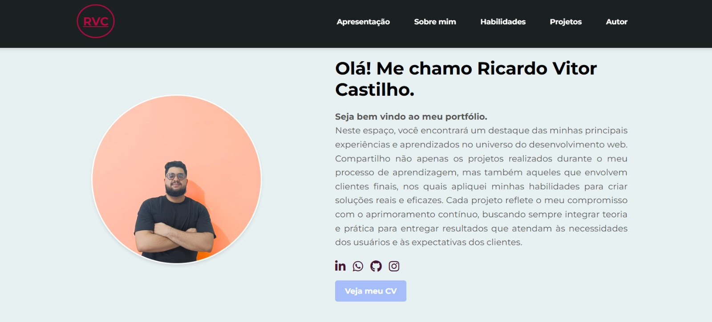
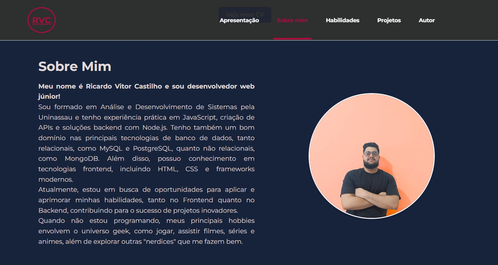
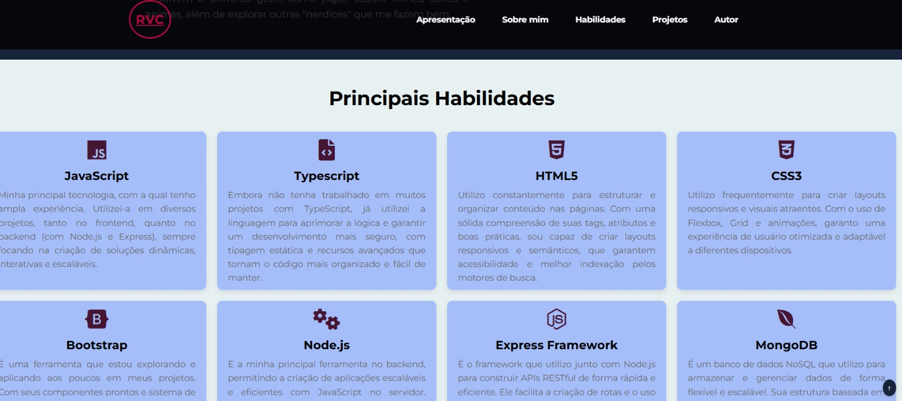
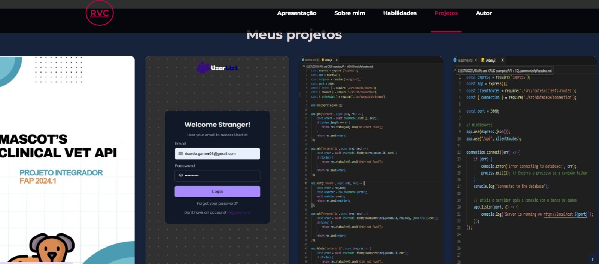

# Meu Portfólio

Este é o meu **portfólio pessoal**, desenvolvido para mostrar meus projetos, habilidades e informações sobre minha carreira. O objetivo deste projeto é fornecer uma visão geral das minhas experiências e das tecnologias com as quais trabalhei, bem como permitir que os visitantes conheçam meu trabalho.

O portfólio é responsivo, com uma interface amigável e moderna, e inclui seções como "Apresentação", "Sobre Mim", "Habilidades", "Projetos" e "Autor".

## 🚀 Funcionalidades

- Menu de navegação: Navegação simples e intuitiva para acessar diferentes seções do portfólio.
- Design Responsivo: Adaptação da interface para dispositivos móveis e desktops.
- Botão de voltar ao topo: Um botão flutuante para permitir que o usuário retorne ao topo da página facilmente.

## 🛠️ Tecnologias Utilizadas

- HTML para estruturação da página.
- CSS para estilização e design responsivo.
- JavaScript para interação com a interface (menu hambúrguer).
- Flexbox: Utilizado para o layout e distribuição de elementos.

## Layout completo





## 📂 Estrutura do projeto

```plaintext
/
├── src/
│   ├── css/               # Arquivos de estilo
│   │   ├── reset.css
│   │   ├── globals.css
│   │   └── responsive.css
│   ├── images/            # Imagens do projeto
│   ├── js/                # Arquivos de JavaScript
│   │   └── script.js
├── index.html             # Página principal do projeto
└── README.md              # Este arquivo
```

## 🌐 Como Rodar o Projeto

**Pré-requisitos**

Não é necessário instalar nenhum framework ou servidor local para rodar esse projeto, pois ele é uma página estática. Você só precisa de um navegador moderno.

**Executando**

1. Clone o repositório para sua máquina local:
```bash
git clone https://github.com/RicardoVCastilho/portfolio-ricardo-castilho
```

2. Abra o arquivo index.html no seu navegador de preferência.

3. Pronto! Você verá meu Portfólio completo.

## **Confira você mesmo e me dê seu feedback**
- Confira o projeto em: [GitHub](https://github.com/RicardoVCastilho/portfolio-ricardo-castilho)

- Encaminhe seu feedback, via [LinkedIn](https://www.linkedin.com/in/ricardo-vitor-castilho-b60039241/);

- Ou no [GitHub](https://github.com/RicardoVCastilho).

## **Autor**
Projeto desenvolvido por [Ricardo Vitor Castilho](https://github.com/RicardoVCastilho)
